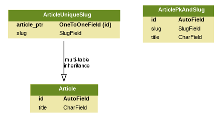

# django-slugs-example-app
A basic app to show how to generate slugs based in a  model's field.

This app shows the concepts explained at: https://simpleit.rocks/python/django/generating-slugs-automatically-in-django-easy-solid-approaches/

Demo: https://django-slugs-example-app.herokuapp.com/ (db reset daily)

# Installation

~~~ bash
python3 -m venv ~/.virtualenvs/django-slugs-example-app
pip install -r requirements.txt
source ~/.virtualenvs/django-slugs-example-app/bin/activate
./manage.py migrate
~~~

Run example site: `./manage.py runserver`.

# Models

# Views

~~~
/                            blog.views.ArticleListView               article-list             
/blog/<int:pk>-<str:slug>/   blog.views.ArticlePkAndSlugDetailView    article-pk-slug-detail   
/blog/<int:pk>/              blog.views.ArticleDetailView             article-detail           
/blog/<str:slug>             blog.views.ArticleUniqueSlugDetailView   articleunique-slug       
/blog/create                 blog.views.ArticleCreateView             article-create
~~~
