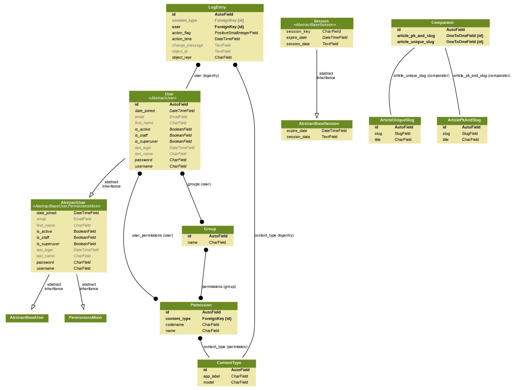

# django-slugs-example-app
A basic app to show how to generate slugs based in a  model's field.

This app shows the concepts explained at: https://simpleit.rocks/python/django/generating-slugs-automatically-in-django-easy-solid-approaches/

Demo: https://django-slugs-example-app.herokuapp.com/ (db reset daily)

# Installation

~~~ bash
python3 -m venv ~/.virtualenvs/django-slugs-example-app
source ~/.virtualenvs/django-slugs-example-app/bin/activate
pip install -r requirements.txt
./manage.py migrate
~~~

Run example site: `./manage.py runserver`.

# Models

# URLs

~~~
/	blog.views.ComparatorListView	article-list
/blog/<int:pk>-<str:slug>/	blog.views.ArticlePkAndSlugDetailView	article-pk-slug-detail
/blog/<str:slug>	blog.views.ArticleUniqueSlugDetailView	articleunique-slug
/blog/create	blog.views.ComparatorFormView	article-create
~~~
